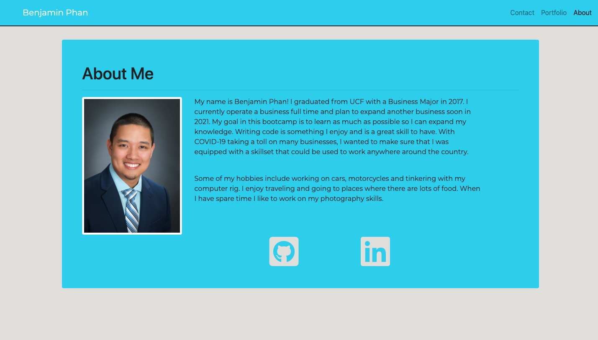

# Creating a Responsive Porfolio Using Bootstrap Project!

This project required me to use Bootstrap's framework to create a responsive website. Having a responsive website is important because it makes your site mobile-friendly and improves the way your website looks on devices with small or large screens.

Link to Repository: https://github.com/bphan94/homework02
Link to Website: https://bphan94.github.io/homework02/

## Navigating the Website!

### Desktop

### Mobile

